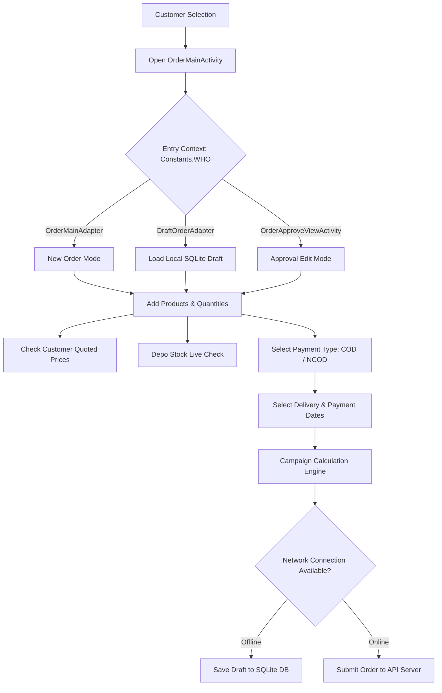

# Place Order Feature Documentation (clickpharma)

## 📌Overview
The **Place Order** module in `clickpharma` enables Medical Information Officers (MIOs) and Sales Representatives to create, manage, calculate campaigns/discounts, draft offline, and submit commercial product orders for customers (pharmacies/dispensaries).

---

## 🏗️ Architectural Overview & File Mapping

### 1. User Interface & Activity
* **Main Screen:** [OrderMainActivity.java](file:///d:/CSTL_Projects/SMC/ePharma/Apps/clickpharma/app/src/main/java/com/creatrix/salessolution/Activity/OrderMainActivity.java)
* **Sample Order Screen:** [SampleOrderActivity.java](file:///d:/CSTL_Projects/SMC/ePharma/Apps/clickpharma/app/src/main/java/com/creatrix/salessolution/Activity/OrderProcess/SampleOrderActivity.java)
* **Order Layout:** [activity_order_main.xml](file:///d:/CSTL_Projects/SMC/ePharma/Apps/clickpharma/app/src/main/res/layout/activity_order_main.xml)

### 2. Adapters & Dialog Components
* **Order Product Item Adapter:** [_product_orderpage_adapter.java](file:///d:/CSTL_Projects/SMC/ePharma/Apps/clickpharma/app/src/main/java/com/creatrix/salessolution/RecyclerAdapter/_product_orderpage_adapter.java)
* **Order Summary Adapter:** [_ordersummary_Recyler.java](file:///d:/CSTL_Projects/SMC/ePharma/Apps/clickpharma/app/src/main/java/com/creatrix/salessolution/RecyclerAdapter/_ordersummary_Recyler.java)
* **Multi-Product Selection:** [MultiOrderAdapter.java](file:///d:/CSTL_Projects/SMC/ePharma/Apps/clickpharma/app/src/main/java/com/creatrix/salessolution/Activity/OrderProcess/Adapter/MultiOrderAdapter.java)
* **Depo Stock Check Adapter:** [DepoStockAdapter.java](file:///d:/CSTL_Projects/SMC/ePharma/Apps/clickpharma/app/src/main/java/com/creatrix/salessolution/Activity/OrderProcess/Adapter/DepoStockAdapter.java)
* **Campaign Popup Adapter:** [CampaignPopAdapter.java](file:///d:/CSTL_Projects/SMC/ePharma/Apps/clickpharma/app/src/main/java/com/creatrix/salessolution/Activity/OrderProcess/Adapter/CampaignPopAdapter.java)

### 3. Business Logic & Presenters
* **Order Management Presenter:** [OrderManagementPresenter.java](file:///d:/CSTL_Projects/SMC/ePharma/Apps/clickpharma/app/src/main/java/com/creatrix/salessolution/Presenter/OrderManagementPresenter.java)
* **Product Presenter:** [ProductPresenter.java](file:///d:/CSTL_Projects/SMC/ePharma/Apps/clickpharma/app/src/main/java/com/creatrix/salessolution/Presenter/ProductPresenter.java)
* **View Contract Interface:** [IOrderManagement.java](file:///d:/CSTL_Projects/SMC/ePharma/Apps/clickpharma/app/src/main/java/com/creatrix/salessolution/Interface/IOrderManagement.java)

### 4. Database & Storage Layer
* **Local Database CRUD:** [DBCrudHelper.java](file:///d:/CSTL_Projects/SMC/ePharma/Apps/clickpharma/app/src/main/java/com/creatrix/salessolution/DBAdapter/DBCrudHelper.java)
* **Product SQLite Helper:** [ProductSQLiteHelper.java](file:///d:/CSTL_Projects/SMC/ePharma/Apps/clickpharma/app/src/main/java/com/creatrix/salessolution/DBAdapter/ProductSQLiteHelper.java)

### 5. Network & API Service
* **Order API Interface:** [OrderProcessAPICALL.java](file:///d:/CSTL_Projects/SMC/ePharma/Apps/clickpharma/app/src/main/java/com/creatrix/salessolution/Network/OrderProcessAPICALL.java)
* **Retrofit Client:** [RetrofitClientOrderProcessInstance.java](file:///d:/CSTL_Projects/SMC/ePharma/Apps/clickpharma/app/src/main/java/com/creatrix/salessolution/Network/RetrofitClientOrderProcessInstance.java)

---

## 🔄 Core Workflows & Logic

### 1. Order Entry Modes (`Constants.WHO`)
- **New Order (`OrderMainAdapter`):** Initializes empty order for selected customer.
- **Draft Order (`DraftOrderAdapter`):** Restores saved order details (products, quantity, payment types, remarks) from SQLite local storage for editing or offline sync.
- **Approval Update (`OrderApproveViewActivity`):** Allows updating an existing pending order in the approval workflow.

### 2. Product Search & Quoted Price Rules
- Fast product search using autocomplete text fields.
- Checks customer-specific custom pricing via `crudHelper.GetQuotedPrice(customerId, productId)`.
- Prevents duplicate product entries and enforces positive quantity rules.

### 3. Payment & Delivery Options
- **COD (Cash on Delivery):** Payment date selection hidden.
- **NCOD (Non-Cash on Delivery):** Requires mandatory payment date selection.
- Delivery Date picker with past-date restriction (`UtilityHelper._datePickNum_DisableOldDates`).

### 4. Campaign & Discount Engine
- Computes promotional schemes dynamically via `SelectCampaign()` API.
- Sends payload containing product list, quantities, unit prices, and payment types (`COD`/`NCOD`).
- Calculates Trade Price (TP), VAT, Discount values, and bonus products.

### 5. Offline Draft & Online Sync Mechanism
- **Drafting:** `OrderDraft()` serializes order data and saves it locally via `DBCrudHelper`.
- **Submission:** `OrderSubmit()` constructs `OrderMasterModel` and sends it to remote servers via `OrderManagementPresenter.makeOrder2()`.
- Supports tracking order status (`Synced` vs `Not Synced`).

---

## 🔑 Key Models
- **`OrderMasterModel` / `OrderMaster`:** Contains order header, customer ID, employee ID, delivery date, payment mode, remarks, and array of item details.
- **`Product`:** Holds Product ID, Name, Unit Price, VAT %, Quantity, TP, and net amount.
- **`CampaignGetReq` / `CampaignModel` / `CampOrderDetails`:** Request and response schemas for campaign calculation.
